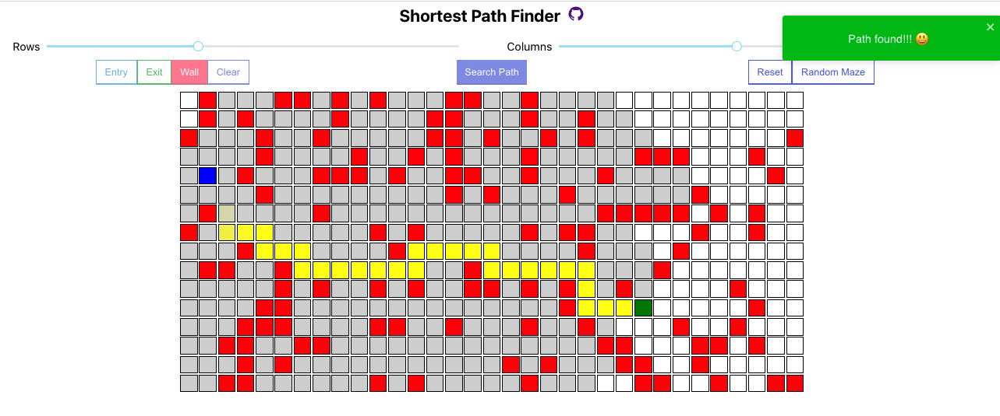

<h2>Shortest Path Finder (Visualizer)</h2>

### Shortest Path Finder using BFS algorithm in React

<a href="https://git@github.com:Sugar3201/Shortest-Path-Finder.git">Live demo</a>

### Running in your local

- `git@github.com:Sugar3201/Shortest-Path-Finder.git`
- `npm install` (after navigating inside the directory)
- `npm start`

### Features

- Responsive grid layout for screen sizes
- Rows and columns control
- Custom maze building options
- Random maze generator
- Path length display
- Mobile support
- Easy to understand and implementable code

------------

##### Feel free to reuse or modify the code/project for your personal or professinal purposes
##### Raise PR for any bugs/imporvements
